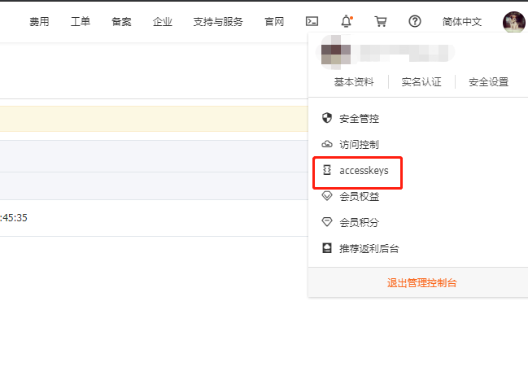
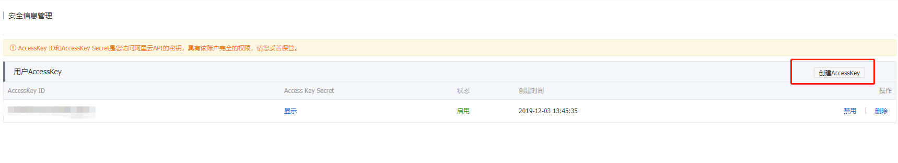

# ddns-aliyun

```bash
@author tinko
@version 0.1.0
```

ddns-aliyun 是基于[阿里云解析DNS](https://help.aliyun.com/product/29697.html)服务的动态解析脚本，用于检测 IP 变化并更新至阿里云，支持多域名解析。支持 Linux 设备，包括树莓派（[Raspberry Pi](https://www.raspberrypi.org/)）。不需要手动添加解析，只要跟着教程来，小白都可以很快上手（软件都不会安装的除外）。

---

## 关键词

1. domain  域名
2. sub_domain  二级域名，子域名

## 前置条件

1. Git
2. python 3.*
3. 阿里云账号

## 使用方法

首先，确保已经安装 [git](https://git-scm.com/) 客户端以及 [python 3.*](https://www.python.org/downloads/)，建议python 3.6+

---

通过本命令获取 ddns-aliyun

```bash
git clone https://github.com/dingguotu/ddns-aliyun.git
```

---

接下来到阿里云中创建AccessKey，具体步骤是：
登录阿里云 -> 进入控制台 -> 点击accesskeys 

-> 创建AccessKey 

---

如果域名是在腾讯云或其他非阿里云处购买的，还需要进入相对应的服务商控制台，修改域名的DNS地址为：

```bash
ns1.alidns.com
ns2.alidns.com
```

---

复制 `conf.sample.json` 文件，并重命名为 `conf.json`，根据您的DNSPod设置修改 `conf.json` 文件，填入以下内容：

```bash
{
    "access_key": <access_key>,
    "access_secret": <access_secret>,
    "domains": [
        {
            "name": <first_domain>,
            "sub_domains": [<first_sub_domain_name>, <second_sub_domain_name>,...]
        },
        {
            "name": <second_domain>,
            "sub_domains": [<first_sub_domain_name>, <second_sub_domain_name>,...]
        }
    ]
}
```

`domains`部分，想绑定几个就写几个，不需要多写，`sub_domains`通常写 `@` 和 `*` 就够了，二级子域名直接用 `*` 代替，然后在自己的代理服务器（IIS，nginx，Apache等）上面去进行绑定。domain 和 sub_domain 可以不需要事先手动绑定，本程序会自动识别

---

最后设置 crontab 定时任务，以便更新DNS记录：

```bash
sudo crontab -e
/30 * * * * python /home/pi/ddns/ddns.py
```

本教程的定时任务是Linux版本，`/30` 表示每隔30分钟运行一次，可以自行修改，本教程不做限定。`/home/pi/ddns/ddns.py` 是绝对路径，请根据实际情况进行修改

Windows版请自行学习[Windows 任务计划](https://jingyan.baidu.com/article/0964eca26a53b08285f536d2.html)
